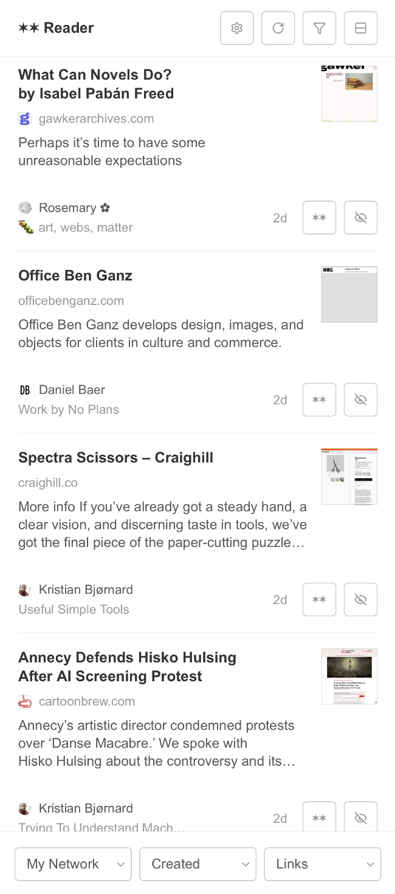
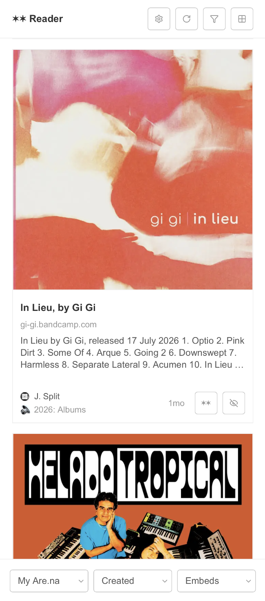
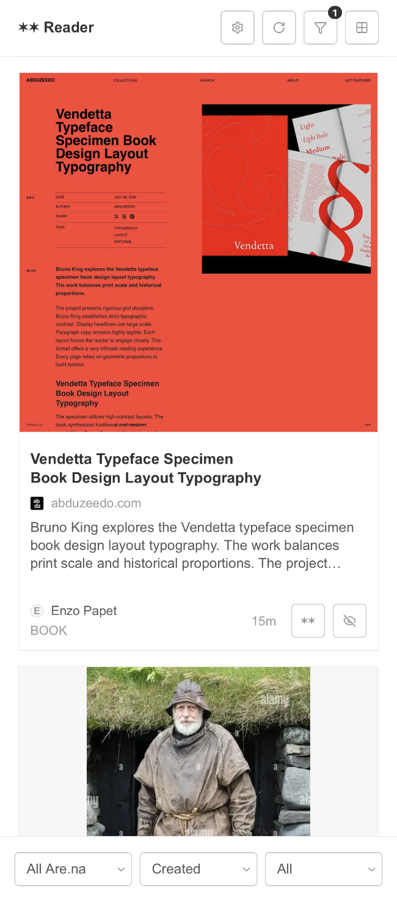
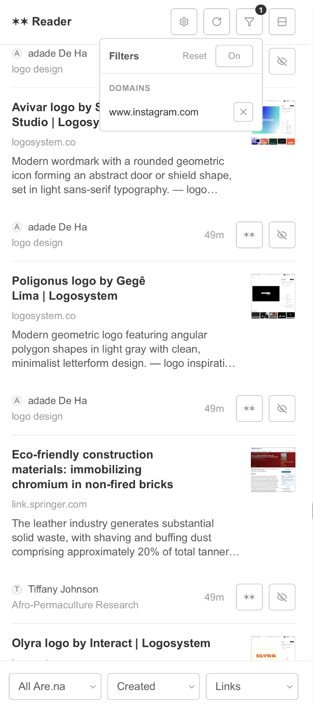

# ✶✶ Reader
Simple [are.na][A] feed reader.

## Who?
[J.Split][A/JS] product designer & collaborator in Chicago, IL.  

## What?
| My Network | My Are.na | All Are.na | Filters |
| :--: | :--: | :--: | :--: |
|  |  |  |  |

**✶✶ Reader** is a simple feed for browsing content on [are.na][A] inspired by RSS reading conventions.

Show blocks in a feed from your network, yourself, or everyone. Sort content by block **creation date**, recently updated status, or randomly. Filter by links, images, embeds, attachments, text, or all. Navigate with familiar keyboard shortcuts like `j/k` for next and previous feed entries, `tab` for cycling between controls and content, and `?` to view the rest.

When browsing the feed easily jump to source URLs, blocks, users, or channels. Blocks added to multiple channels in a row will display the first channel they were added to instead of appearing multiple times in the feed. Apply temporary mutes to users, channels, or domains to declutter your feed. These don't affect who you follow or mute on are.na and are easy to reset and undo.

## Where?
[arena-reader.jsplit.me][JS/A]

## When?
Joined ✶✶ August 2018, built Summer 2026, ongoing updates at a hobbyist pace.  

## Why?
Functionally, are.na is a simple platform for sharing and saving links, images, text, embeds, and attachments to channels. This is a great utility for an individual, but the magic of the platform comes from doing this in parallel with other users. I have described this magic as:

> like quietly sharing a table at the library with strangers [✶✶][A/Q1]

> social media retirement community [✶✶][A/Q2]

Once you have followed many users, the feed becomes tricky to navigate. Are.na's explore page and search mitigate this problem well with robust filtering and sorting. In Are.na's iOS app, channels and notifications can be viewed at different densities from list to grids. This application applies those solutions, along with conventions from RSS readers, to the feed.

I built this to serve my own use case built out of 8 years of Are.na habits. I want to see what unique links the people I follow on are.na have recently added, in chronological order, in the style of RSS, with full are.na attribution and basic link metadata. In the spirit of modularity, the inputs and views are open-ended enough to shape the reading experience around a diverse set of preferences.

## How?
✶✶ Reader is an unofficial web app built by [J.Split][A/JS] using [Are.na's developer API][A/API], Claude Code, Figma, and Github pages.

[A]: https://www.are.na
[A/JS]: https://www.are.na/j-split/index "J. Split | Are.na"
[A/Q1]: https://www.are.na/block/7497080 "like quietly sharing a table at the library with strangers."
[A/Q2]: https://www.are.na/block/12722144 "social media retirement community"
[A/API]: https://www.are.na/developers/explore "Are.na API Documentation | Explore the v3 REST API endpoints"
[JS/A]: https://arena-reader.jsplit.me